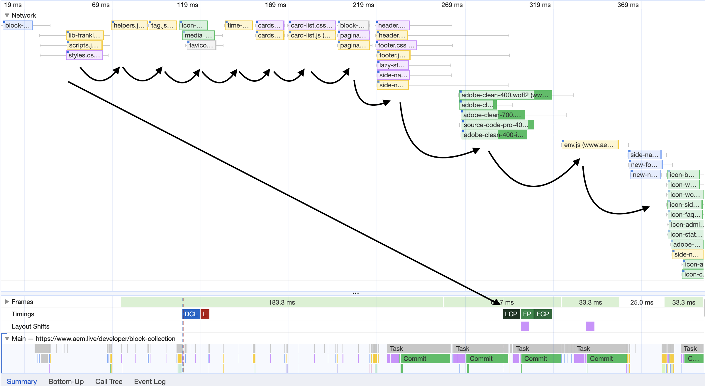

# Edge Performance

As it states

```markdown
If you start your project with the Boilerplate as in the Developer Tutorial, you will get a very stable Lighthouse score that is 100. On every component of the lighthouse score there is some buffer for the project code to use and still be within the boundaries of a perfect 100 score.
```

Main point to focus here is
Please check
[Three-Phase Loading](https://www.aem.live/developer/keeping-it-100#three-phase-loading-e-l-d)

Edge defines as 3 phases

- **Phase E (Eager):** This contains everything that's needed to get to the largest contentful paint (LCP).
- **Phase L (Lazy):** This contains everything that is controlled by the project and largely served from the same origin.
- **Phase D (Delayed):** This contains everything else such as third-party tags or assets that are not material to experience.

The good:

1. **Good Backend Performance**
2. **LCP Blocks**
3. **Proper Eager first LCP image.**
4. **Deliver minimal for LCP**
5. **Font fallback plugin**

Could improve:

1. **Header**
2. **No mention of preloading**
3. **Fixed code required to configure LCP_BLOCKS**

Problems:

1. **Queue / Prioritization with async-await code**
2. **Icons as initial decoration script**

# Good

## Good Backend Performance

Very good backend performance OOB and very small footprint under CDN.
This seems the most impacting performance, at CDN in several sites, content and assets can reach amazing speed.

### Production sites with server response under 40ms

Examples

- [Netcentric.biz](https://www.netcentric.biz/)
- [AEM Live](https://www.aem.live/home)

## LCP Blocks

One great point is to be able to configure what blocks represent LCP

```javascript
// at their script they allow a LCP_BLOCKS
const LCP_BLOCKS = ['hero', 'logo-wall'];
```

## Eager first LCP image

Although backend renders the first image as `loading="lazy"`, they transform it to `loading="eager"` at the blocking level, keeping it as good as it were preloaded.

## Fonts

They offer a plugin to properly check and set up custom fonts to avoid CLS [font fallback plugin](https://www.aem.live/developer/font-fallback)

# Could Improve

## Header

Although they enforce that the header is not LCP, that definitely is the case in several Henkel sites where the logo is the main LCP, or header impacts CLS. So a non-prioritized header can easily impact CLS and, in some cases, even LCP.

## Some Assets Could Be Preloaded.

In some cases, preloading some assets would offer advantages on LCP and FP.

## Fixed Code Required to Configure LCP_BLOCKS

That also can be an issue if you have different blocks on different pages.

# Problems

Well, although it's actually a well-performing script, it relies a lot on queue and async-await.

- Async function, if you actually await, becomes basically synchronous code.

Queue will always offer a step-by-step loading and reduce the concurrency, increasing the time to load overall and can lead to longer load times.

## This Repo on OOB Script on Regular WiFi Network No CDN


## This Repo on OOB Script on Slow 3G


Get's clear the async-await/queue impact.

## At Netcentric.biz


## At AEM.live



## Here another issue due to icons loaded before since they are defined at the initial script

Concern of icons should not be at the main script.

