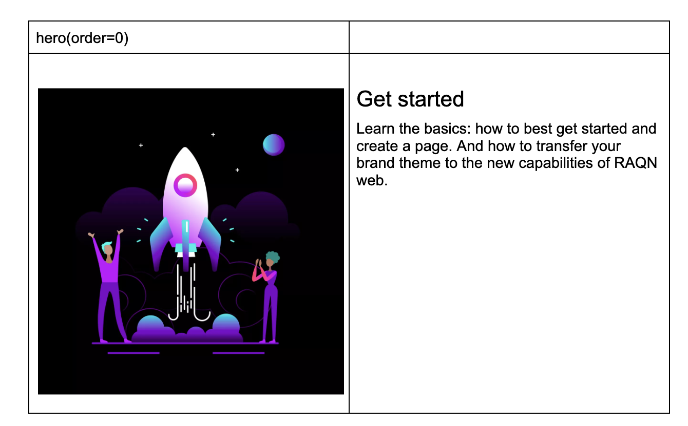

# Component-Based Development with Custom Elements

We aim to add features as reusable components instead of a composition of functions.

This approach allows us to:

1. Have a clear component life cycle.
2. Enforce good code practices.
3. Facilitate easy reusability.

## Defining Concerns and Features in Component-Based Architecture

For better separation of concerns, we should define features as components.

Let's consider an example by examining some concerns defined in the main OOB script for EDS:

1. Decorate buttons.
2. Placeholders.
3. Load icons.
4. Restructure headings.

These concerns should not be part of the general initial script:

- A button should be the concern of its component, not a convention based on being inside a div.
- Placeholders should be the concern of sites that require them.
- Icons should only be loaded for pages that need them.
- Headings can be defined by authors, and semantic meaning should also be the concern of authors or a specific component.

We should be able to set components and features on the fly without obligations as components.

## Simple Component Loader

Instead of using several decoration functions, we can set up a simple component loader to "decorate and prepare."

This approach allows:

1. Keeping the "blocks" as functional scripts.
2. Using custom elements instead.
3. Properly setting up data and params from the class instead of semantic content data.
4. Setting params per breakpoint.

## Component Loader

### Setup Params and Custom Elements

Document example:


With the example, our component loader will:

1. Attempt to load a hero component or block.
2. Check if the loaded default has a name and not a function named "decorate."
3. Read and create element attributes based on class names.
4. If not, it will create a custom element based on the name of the component.
5. If it is a decorate function, keep it as EDS.

## Base Custom Element Component

A standard custom element is our definition of a component:

1. Extends HTMLElement.
2. Predefines some extra life cycle methods:
   1. `connectedCallback`
   2. Load external content if the `external` property exists.
   3. Run the component loader on its content if external.
   4. Add a life cycle for processing external HTML as `processExternal`.
   5. Add a `connected` callback after previous setup and externals are loaded.
   6. Add a `ready` life cycle to set up things when everything is ready.
3. Keeps all other custom element features.

See [component-base](../../scripts/component-base.js)

With the component loader, it will be rendered as:

```html
<raqn-hero id="gen629e56de">
  <div>
    <picture>
      <!-- ... -->
    </picture>
  </div>
  <div>
    <h2 id="get-started-1">Get started</h2>
    <p>
      Learn the basics: how to best get started and create a page. And how to
      transfer your brand theme to the new capabilities of RAQN web.
    </p>
  </div>
</raqn-hero>
```

## Custom Element Example

Let's bring that custom element to life:

```javascript
import ComponentBase from '../../scripts/component-base.js';

export default class Hero extends ComponentBase {
  static observedAttributes = ['order'];

  ready() {
    this.order = this.getAttribute('order');
    // Add some extra classes
    this.classList.add('full-width');
    this.setAttribute('role', 'banner');
    // Set up a CSS variable
    this.style.setProperty('--hero-hero-order', this.getAttribute('order'));
  }
}
```

This example:

1. Uses the `ready` callback when the custom element is defined and added to the page.
2. Sets up some classes, attributes, and sets a CSS variable.

### Passing Attributes to Your Component

Let's use the document to pass the param:



With this change, you will pass a param to your component:

```html
<raqn-hero order="0" id="gen58aa7c0c" class="full-width" role="banner">
  <div>
    <picture>
      <!-- ... -->
    </picture>
  </div>
  <div>
    <!-- ... -->
  </div>
</raqn-hero>
```

Now, let's add a little style at `hero.css`:

```css
/* Block-specific CSS goes here */
raqn-hero {
  --hero-background-color: var(--scope-background, black);
  --hero-color: var(--scope-color, white);
  --hero-grid-template-columns: 0.6fr 0.4fr;
  --hero-hero-order: 0;

  background-color: var(--hero-background-color);
  color: var(--hero-color);
  align-items: center;
  grid-template-columns: var(--hero-grid-template-columns, 1fr);

  @media screen and (max-width: 768px) {
    --hero-grid-template-columns: 1fr;
  }

  & > div:first-child {
    order: var(--hero-hero-order);
  }
}
```

Now, we should have something like (apart from theme definitions, see [theme](theme.md)):


### Changing Params by Document


These changes will:

1. Set the param to 1.
2. Set the variable order to CSS.

Then we'll see changes like:


A param is set to all viewports.

## Setting Param Only to a Viewport

To set a param only to a specific viewport, prefix it with the viewport key:

1. **xs**: 0 to 479,
1. **s**: 480 to 767,
2. **m**: 768 to 1023,
3. **l**: 1024 to 1279,
4. **xl**: 1280 to 1919,
5. **xxl**: 1920.

Let's set the order param to apply only on the S (0 to 767) viewport:


Now, the param is only set on S viewports:


Where:

1. Regular params will be set to all viewports.
2. Prefixed params will be applied only to the specific viewport, overriding the general one.