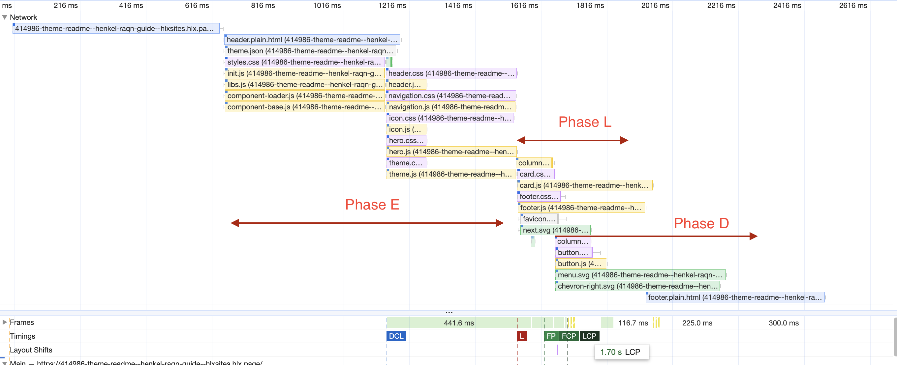

# Perfomance 

So we want to improve the overall performance on EDS.

## Edge Delivery

Edge delivery scripts have those premises in mind:

1. Eager (Priotize main files, style.css, script.js, etcs)
2. Lazy (queue the second priority)
3. Delay (Delay other code)

You can check more in [](../edge/perfomance.md)

## Assumptions 
As state in [Keeping It 100, Web Performance
](https://www.aem.live/developer/keeping-it-100#three-phase-loading-e-l-d)
```It is a good rule of thumb to keep the aggregate payload before the LCP is displayed below 100kb, which usually results in an LCP event quicker than 1560ms (LCP scoring at 100 in PSI). Especially on mobile the network tends to be bandwidth constrained, so changing the loading sequence before LCP has minimal to no impact.```

That actually is a key factor to good LCP and loading.
And we would call it perfomance __BUDGET__ and queueing should influence that.


## Let the load be fluid instead of queue.

Base on that premise, we should avoid by default having too much assets and scripts loaded in the main priority
But at the same time queuing those endups removing the benefits of concurency among other things

### Default bootstrap script


Here we have the example of the impact of queueing under this page load.

Where you can see several assets are queue before even the FCP and LCP

1 - DOMContentLoaded and Load event conflict 
2 - That counts that all LCP script should be at style.css
3 - We have several ms between FCP and LCP, and that opens a window of CLS
4 - loading is "strech" for several milliseconds before LCP

That becames clear when slow network is applyed


Queuing impact now is quite clear.


### Checking concurency and delaying

So having the same rule of thumb of a perfomance budget for LCP under 100kb, let's check 3 main hipotesis.

1. Concurrency would be better
2. Solving Load and DOMContentLoaded conflict 
3. Using concurency freeing the LCP and FCP would improve perfomance

So since the OOB script does already queue we already have that use case covered and mesure as following
__Regular network__

__slow network__


Other examples on EDS perfonmance can be found [here](../edge/perfomance.md)

## Then lets try the first Hipotecy

Scripts will keep the 3 phases defined in EDGE but with better concurency

Let's see the example
__Regular network__

__slow network__
 


   - **Editorial Control Over LCP (Largest Contentful Paint):** Allowing editors to specify which components serve as the largest contentful paint on each page.
   - **Selective Eager Loading of Images:** Providing the capability to selectively load images eagerly based on editorial preferences and performance considerations.