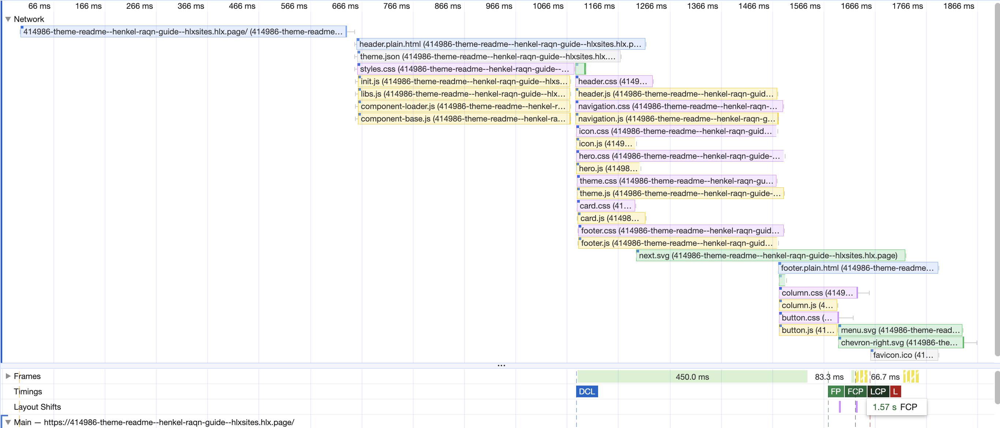
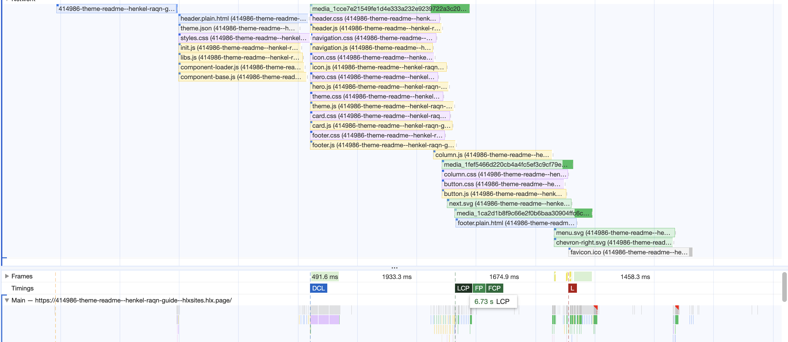

# Perfomance 

So we want to improve the overall performance on EDS.

## Edge Delivery

Edge delivery scripts have those premises in mind:

1. Eager (Priotize main files, style.css, script.js, etcs)
2. Lazy (queue the second priority)
3. Delay (Delay other code)

You can check more in [](../edge/perfomance.md)

## Assumptions 
As state in [Keeping It 100, Web Performance
](https://www.aem.live/developer/keeping-it-100#three-phase-loading-e-l-d)
```It is a good rule of thumb to keep the aggregate payload before the LCP is displayed below 100kb, which usually results in an LCP event quicker than 1560ms (LCP scoring at 100 in PSI). Especially on mobile the network tends to be bandwidth constrained, so changing the loading sequence before LCP has minimal to no impact.```

That actually is a key factor to good LCP and loading.
And we would call it perfomance __BUDGET__ and queueing should influence that.


# OOB Implementation Queue.

Base on that premise, we should avoid by default having too much assets and scripts loaded in the main priority
But at the same time queuing those endups removing the benefits of concurency among other things

### Default bootstrap script


Here we have the example of the impact of queueing under this page load.

Where you can see several assets are queue before even the FCP and LCP

1. DOMContentLoaded and Load event conflict 
2. That counts that all LCP script should be at style.css
3. We have several ms between FCP and LCP, and that opens a window of CLS
4. loading is "strech" for several milliseconds before LCP

That becames clear when slow network is applyed


Queuing impact now is quite clear.


## Checking concurency and delaying

So having the same rule of thumb of a perfomance budget for LCP under 100kb, let's check 3 main hipotesis.

1. Concurrency would be better
2. Solving Load and DOMContentLoaded conflict should be solve
3. Using concurrency but keeping 3 fases improve perfomance

Other examples on EDS perfonmance can be found [here](../edge/perfomance.md)

## Concurrency, Load and keeping 3 fases.

We can improve perfomance by concurrency load and keeping the 3 fases 
Scripts will keep the 3 phases defined in EDGE but with better concurency

Let's see the example
__Regular network__

__slow network__
 

Here we already can see 2 improvements 

1. Concurrency reduce the overall load time and LCP, both in regular and slow networks
2. DOMContentLoaded fired during html resources parse ends, then at Load event is fired after the EAGER phase 

## Concurrency, Load and removing 3 fases.

In this example we don't force delay we just priorize loading to in case of stalled loading.

1 - Priorize LCP defined ones
2 - Allow other things on the page to load toguether at the end of prio

__Regular network__

__slow network__
 


So here we can find a even better perfomance.

1. More cucurrency improves the overall perfomance and LCP
2. DOMContentLoaded fired correcly and load fires correcly on complete of the page.
3. Just priorizing loading into LCP components but let other load offer better gains specially on slow networks.


# conclusion 

So we choose the regular priorizing and concurrency load that would offer better gains, specially if we follow the
```It is a good rule of thumb to keep the aggregate payload before the LCP is displayed below 100kb, which usually results in an LCP event quicker than 1560ms (LCP scoring at 100 in PSI). Especially on mobile the network tends to be bandwidth constrained, so changing the loading sequence before LCP has minimal to no impact.```

# Editorial Control Over LCP

So many pages can have diferent templates and components and sometimes that can Impact the LCP.

1 - We want to be able to select how many images would be priorized.
2 - We want to define what components should be priorized to LCP

## meta data to defined LCP and Eager images
We can define what components should be priorized at metadata


1. lcp, comma-separeted components/block names
2. eager-images, number of images that should have loading eager

## Defining LCP components

Here it's a example without defining a LCP,
It loads by order of aperence

1. Notice that the navigation component is under the header component 
2. It's load at the end of the queue since it's the last aperance (html loads, header loads, then navigation apears, navigation loads)

Now let's add the LCP in this order
 - `header, theme, navigation`


Let's check the loading diference 


   - **Editorial Control Over LCP (Largest Contentful Paint):** Allowing editors to specify which components serve as the largest contentful paint on each page.
   - **Selective Eager Loading of Images:** Providing the capability to selectively load images eagerly based on editorial preferences and performance considerations.