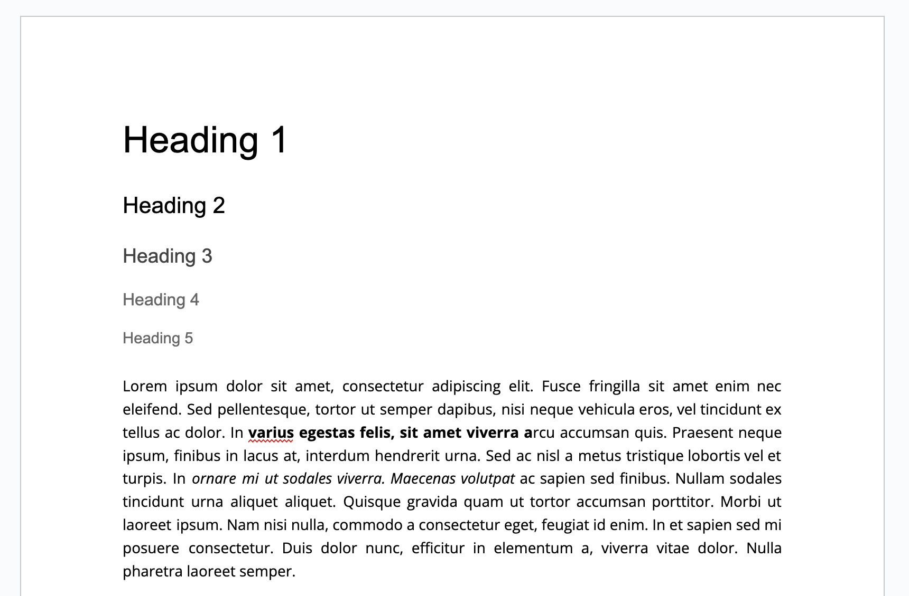
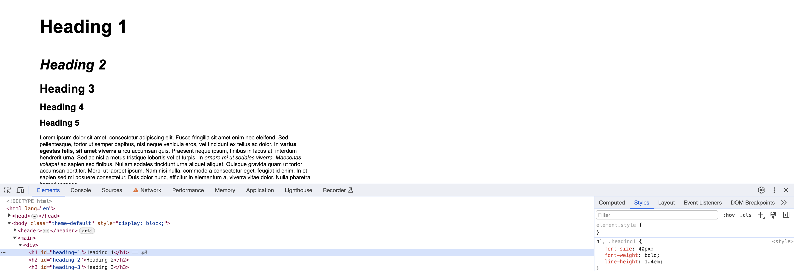
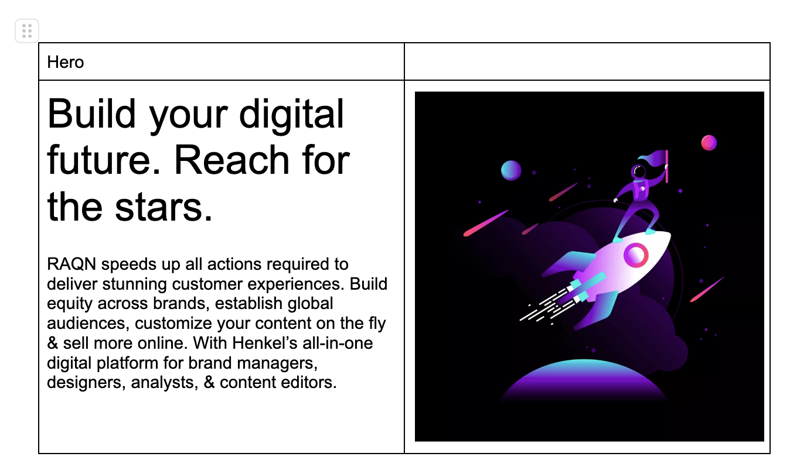
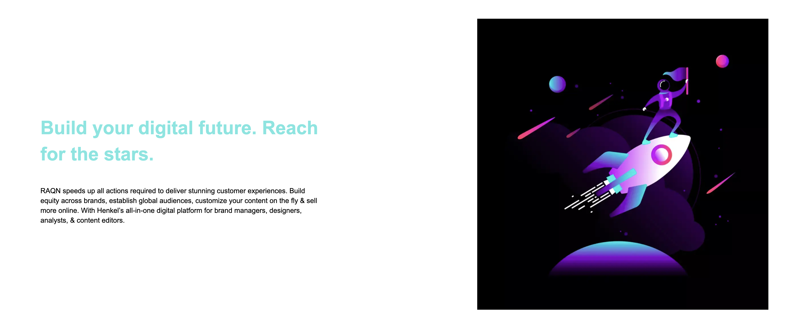

# Theming

For better future developments we want to create some theme capabilities under EDS enviroment
This means that an author could:

1. __Change layout__
2. __Change colors__
3. __Change icons__
4. __Change Fonts definitions__


## CSS variables for theme

Based on the EDS cababilities of delivering a spreadsheet as json,
we'll use a theme.xls as a theme storage.

So let's take a look at this example:


Let's take a look

- First row define name of the theme, can be used as strings like primary secondary or numbers, althoult numbers are smaller and easier to use. __(the A1 cell ilustrative and it's value is ignored)__
- The first column defines the property / variable name you want to use.

So for a nice theme application well need:
 - global css variables
 - Atomic classes for styling components or blocks
 - full theme classes to apply all properties


So the theme component will render those as 

Basic rule would be:

```javascript 

${property}-${columnName}: ${value};

```

```css
/* global css variables */
body {
    --raqn-color-1: red;
    --raqn-color-2: blue;
    --raqn-color-default: black;
    --raqn-background-1: #eee;
    --raqn-background-2: #ddd;
    --raqn-background-default: #fff;
}
/* Atomic classes with specificity of 2 */
body .color-1 {
    --scope-color: var(--raqn-color-1);
}
body .color-2 {
    --scope-color: var(--raqn-color-2);
}
body .color-default {
    --scope-color: var(--raqn-color-default);
}
body .background-1 {
    --scope-background: var(--raqn-background-1);
}
body .background-2 {
    --scope-background: var(--raqn-background-2);
}
body .background-default {
    --scope-background: var(--raqn-background-default);
}
/* them classes to apply all scopes */
.theme-1 {
    --scope-color: var(--raqn-color-1);
    --scope-background: var(--raqn-background-1);
}
.theme-2 {
    --scope-color: var(--raqn-color-2);
    --scope-background: var(--raqn-background-2);
}
.theme-default {
    --scope-color: var(--raqn-color-default);
    --scope-background: var(--raqn-background-default);
}
```

## font tags 
So for defining default font sizes and other properties we also have a second column

Main diference is that we need fonts to be defined independent of theme and to simplyfy 


rule would be 
```javascript
${tags} {
    // allowed properties: 'font-size', 'font-weight', 'font-family', 'line-height', 'font-style'
    ${property}: ${value};
}
```
Output in css 
```css
h1, .heading1 {
    font-size: 40px;
    font-weight: bold;
    line-height: 1.4em;
}
h2, .heading2 {
    font-size: 30px;
    font-weight: 600;
    line-height: 1em;
    font-style: italic;
}
h3, .heading3 {
    font-size: 25px;
    font-weight: bold;
}
h4, .heading4 {
    font-size: 20px;
    font-weight: bold;
}
h5, .heading5 {
    font-size: 18px;
    font-weight: bold;
}
p,body,pre,input {
    font-size: 12px;
    font-weight: normal;
    font-family: Roboto,Arial, sans-serif;
    line-height: 1.2em;
    font-style: normal;
}
```
## fonts example

With the theme defined above let's check the application
Document

Output



## default theme

The __theme and fonts__ are apply by default to the site

```HTML
<body class="theme-default">
<!-- ... -->
</body>
```


## Adicional variables 

You can setup any variables to use as atomic classes but let's create some for general purposes

General purpuse variables
1. __Colors Variables__
    1. __background__: Change general background
    2. __inner-background__: Change a child element background, ex cards background
    3. __link-color__: Link colors 
    4. __link-color-hover__: Link hover and active color
    5. __accent-color__: Buttons and ctas color
    6. __accent-background__: Buttons and ctas background
    7. __accent-color-hover__: Buttons and ctas hover and active color
    8. __accent-background-hover__: Buttons and ctas hover and active background
    9. __header-background__: Header background
    10. __header-color__: Header text color
    11. __headings-color__: Headings color, h1 to h3
    12. __footer-background__: footer background color
2. __Block Model__:
    1. __max-width__: full width / max container, prefered to use vw unit
    2. __padding__: padding of a element
    3. __inner-padding__: padding of a child element, ex cards 
    4. __gap__: grid gap between columns
    5. __margin__: margin of a element
    6. __icon-size__: icon size (square)
3. __Aligment__:
    1. __align__: vertical aliment of elements
    2. __justify__: Horizontal aliment of elements
    

## Example of Theme spreadsheet 
Here a file example
[Theme Example](../assets/theme.xlsx)

## Appling theme 

As mentioned before, the default theme is apply.

Let's take the previous file as example


Let's take a look at default and the C column (1)

So a classname of `.theme-1` would apply the changes on top of the `.theme-default`

So let's check a component example:
A default hero will take the default theme column 

Will look like


We can move it to the second theme by setting a class


## Atomic theming class

We can also change only one of the styles of the theming by join the key row with the first row columns

Example 


At the row 13, the key name is `headings-color` and the theme column is `1` 

So we can apply that value using the classname `headings-color-1`

Here is a example 


Then only the value of headings-color will be changed.

## applying theme without block

We left a special block to use only theme and atomic classes, without having to load or have adicional features
That block is called __Style__

Here's a example:


## Limitations

We also develop a font-face theme definition, but currently EDGE delivery lacks the cabability of maintaining fonts in drive or serving it.

