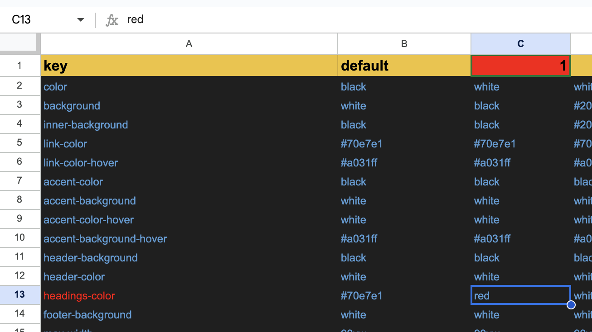

# Theming

To enhance future developments, we aim to introduce theme capabilities within the EDS environment. This empowers authors to:

1. **Change layout**
2. **Adjust colors**
3. **Modify icons**
4. **Define font styles**

## CSS variables for theme

 Leveraging EDS capabilities for delivering a spreadsheet as JSON, we'll employ a `theme.xls` as a theme storage. The following example illustrates the structure:


- The first row defines the name of the theme, which can be expressed as strings (e.g., primary, secondary) or numbers for simplicity. *(Note: The A1 cell is illustrative, and its value is ignored.)*
- The first column outlines the property/variable names.

For effective theme application, we require:

- Global CSS variables
- Atomic classes for styling components or blocks
- Full theme classes to apply all properties

The basic rule for rendering these is:

```javascript
${property}-${columnName}: ${value};
```

```css
/* Global CSS variables */
body {
    --raqn-color-1: red;
    --raqn-color-2: blue;
    --raqn-color-default: black;
    --raqn-background-1: #eee;
    --raqn-background-2: #ddd;
    --raqn-background-default: #fff;
}
/* Atomic classes with specificity of 2 */
body .color-1 {
    --scope-color: var(--raqn-color-1);
}
body .color-2 {
    --scope-color: var(--raqn-color-2);
}
body .color-default {
    --scope-color: var(--raqn-color-default);
}
body .background-1 {
    --scope-background: var(--raqn-background-1);
}
body .background-2 {
    --scope-background: var(--raqn-background-2);
}
body .background-default {
    --scope-background: var(--raqn-background-default);
}
/* Theme classes to apply all scopes */
.theme-1 {
    --scope-color: var(--raqn-color-1);
    --scope-background: var(--raqn-background-1);
}
.theme-2 {
    --scope-color: var(--raqn-color-2);
    --scope-background: var(--raqn-background-2);
}
.theme-default {
    --scope-color: var(--raqn-color-default);
    --scope-background: var(--raqn-background-default);
}
```

## Font tags

To define default font sizes and other properties, a second column is introduced. The key difference is that fonts need to be defined independently of the theme. The rule is:

```javascript
${tags} {
    // allowed properties: 'font-size', 'font-weight', 'font-family', 'line-height', 'font-style'
    ${property}: ${value};
}
```

CSS output:

```css
h1, .heading1 {
    font-size: 40px;
    font-weight: bold;
    line-height: 1.4em;
}
/* ... (other headings and tags) ... */
p,body,pre,input {
    font-size: 12px;
    font-weight: normal;
    font-family: Roboto,Arial, sans-serif;
    line-height: 1.2em;
    font-style: normal;
}
```

## Fonts example

With the theme defined above, let's examine the application:

Document:


Output:


## Default theme

The theme and fonts are applied by default to the site:

```HTML
<body class="theme-default">
<!-- ... -->
</body>
```

## Additional variables

You can set up additional variables for general purposes. Here are some examples:

1. **Colors Variables**
    - `background`: Change general background
    - `inner-background`: Change a child element background, e.g., card backgrounds
    - `link-color`: Link colors
    - `link-color-hover`: Link hover and active color
    - `accent-color`: Buttons and CTAs color
    - `accent-background`: Buttons and CTAs background
    - `accent-color-hover`: Buttons and CTAs hover and active color
    - `accent-background-hover`: Buttons and CTAs hover and active background
    - `header-background`: Header background
    - `header-color`: Header text color
    - `headings-color`: Headings color (h1 to h3)
    - `footer-background`: Footer background color
2. **Block Model**
    - `max-width`: Full width / max container (preferably using vw unit)
    - `padding`: Padding of an element
    - `inner-padding`: Padding of a child element, e.g., cards
    - `gap`: Grid gap between columns
    - `margin`: Margin of an element
    - `icon-size`: Icon size (square)
3. **Alignment**
    - `align`: Vertical alignment of elements
    - `justify`: Horizontal alignment of elements

## Example of Theme spreadsheet

Here's an example file: [Theme Example](../assets/theme.xlsx)

## Applying theme

As mentioned earlier, the default theme is applied. Using the provided file as an example:


Comparing the default and the C column (1), a classname of `.theme-1` would apply changes on top of the `.theme-default`. Thus, a component example using the default hero would take the default theme column:


It would look like:


Moving it to the second theme is achieved by setting a class:


And the resulting preview:


## Atomic theming class

Individual styles of the theme can be changed by combining the key row with the first-row columns. For example:



At row 13, the key name is `headings-color`, and the theme column is `1`. Applying the value is done using the classname `headings-color-1`:


And its corresponding documentation:


## Applying theme without block

A special block named **Style** allows the use of only theme and atomic classes, without loading additional features. Here's an example:


## Limitations

Although we have developed a font-face theme definition, the current EDGE delivery lacks the capability to maintain fonts in drive or serve them:

