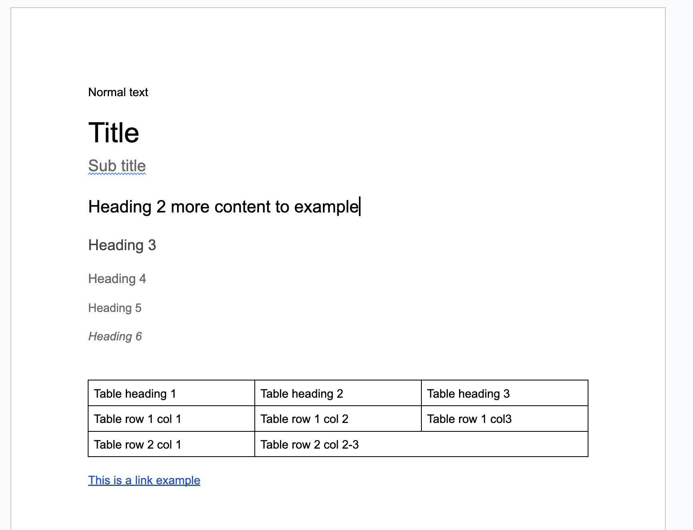
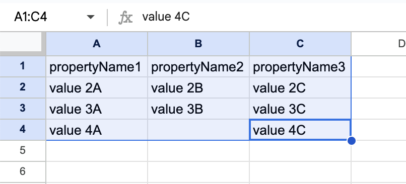

# Edge Delivery

To introduce we're going to breafly talk about the current Edge Delivery Boilerplate / Out of the box (OOB) ways of doing and reasoning what we improve

## Advantages

- Simple document based authoring
- Fast server side delivery

## Simple Document based authoring

This simply resume into 2 things

- docs into HTML
- Excel / spreadsheets into JSON

That way we have a clean simple way to generate HTML and JSON based on documents and document trees

### Docs into HTML - Server side render

A simple doc file with a Example text will be rendered into something like

```HTML
<!doctype html>
<html>
  <head>
    <title>Name of the document</title>
    <link
      rel="canonical"
      href="https://main--henkel-raqn-guide--hlxsites.hlx.page/untitled-document"
    />
    <meta property="og:title" content="Name of the document" />
    <meta
      property="og:url"
      content="https://main--henkel-raqn-guide--hlxsites.hlx.page/untitled-document"
    />
    <meta
      property="og:image"
      content="https://main--henkel-raqn-guide--hlxsites.hlx.page/default-meta-image.png?width=1200&#x26;format=pjpg&#x26;optimize=medium"
    />
    <meta
      property="og:image:secure_url"
      content="https://main--henkel-raqn-guide--hlxsites.hlx.page/default-meta-image.png?width=1200&#x26;format=pjpg&#x26;optimize=medium"
    />
    <meta name="twitter:card" content="summary_large_image" />
    <meta name="twitter:title" content="Name of the document" />
    <meta
      name="twitter:image"
      content="https://main--henkel-raqn-guide--hlxsites.hlx.page/default-meta-image.png?width=1200&#x26;format=pjpg&#x26;optimize=medium"
    />
    <meta name="viewport" content="width=device-width, initial-scale=1" />
    <script src="/scripts/lib-franklin.js" type="module"></script>
    <script src="/scripts/scripts.js" type="module"></script>
    <link rel="stylesheet" href="/styles/styles.css" />
  </head>
  <body>
    <header></header>
    <main>
      <!--
        content of the document
       -->
    </main>
    <footer></footer>
  </body>
</html>
```

It renders the Docs into HTML like the example:

Here's a example document


This will be transform into this apart from the HTML exampled above:

```HTML
<div>
  <p>Normal text</p>
  <h1 id="title">Title</h1>
  <h3 id="sub-title">Sub title</h3>
  <h2 id="heading-2-more-content-to-example">
    Heading 2 more content to example
  </h2>
  <h3 id="heading-3">Heading 3</h3>
  <h4 id="heading-4">Heading 4</h4>
  <h5 id="heading-5">Heading 5</h5>
  <h6 id="heading-6">Heading 6</h6>
  <div class="table-heading-1">
    <div>
      <div>Table row 1 col 1</div>
      <div>Table row 1 col 2</div>
      <div>Table row 1 col3</div>
    </div>
    <div>
      <div>Table row 2 col 1</div>
      <div>Table row 2 col 2-3</div>
    </div>
  </div>
  <p>
    <a href="https://www.w3schools.com/html/html_links.asp">This is a link example</a>
  </p>
</div>
```

So we can resume the server side render into this simple rules:

1- Title formating are H1
2- Sub title formating are h3
3- All other headings follows the proper name - element correlation
4- All headings will be attached a ID based on it's content (example in the "asdkjasdlkja..." content)
5- Tables will render one and only header as a classname, lowercase dash separated
6- Tables rows will create one div per column
7- Tables will be only rendered as <table> when inside another table
8- You can wrapp a div by adding a --- into the document
9- Breaklines are <p>
10- Links most of the time, are wrapped into <p> tags then a <a>

### SpreadSheets into JSON

It also render any SpreadSheets into a simple JSON format


```json
{
  "total": 3,
  "offset": 0,
  "limit": 3,
  "data": [
    {
      "propertyName1": "value 2A",
      "propertyName2": "value 2B",
      "propertyName3": "value 2C"
    },
    {
      "propertyName1": "value 3A",
      "propertyName2": "value 3B",
      "propertyName3": "value 3C"
    },
    {
      "propertyName1": "value 4A",
      "propertyName2": "",
      "propertyName3": "value 4C"
    }
  ],
  ":type": "sheet"
}
```

With some OOB exceptions are also included like

Spreadsheets metadata that
metadata.xls

Requirements

- Clientside Hidratation dom transformation "decoration"
- Manual focus on FCP and LCP
- blocking resources before render

Boiler plate approach
1 - Performance
2 - Decoration by feature
3 - Manualy defining priority
4 - Eager and defered
5 - Semantical content used as component functional content (metadata)
